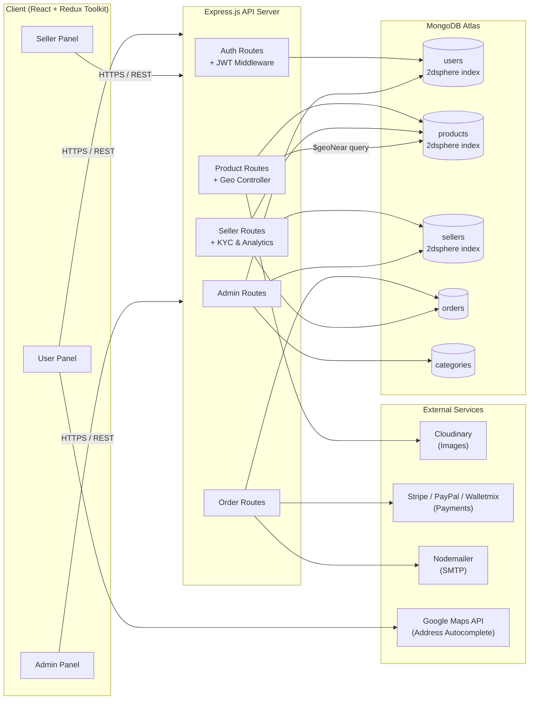
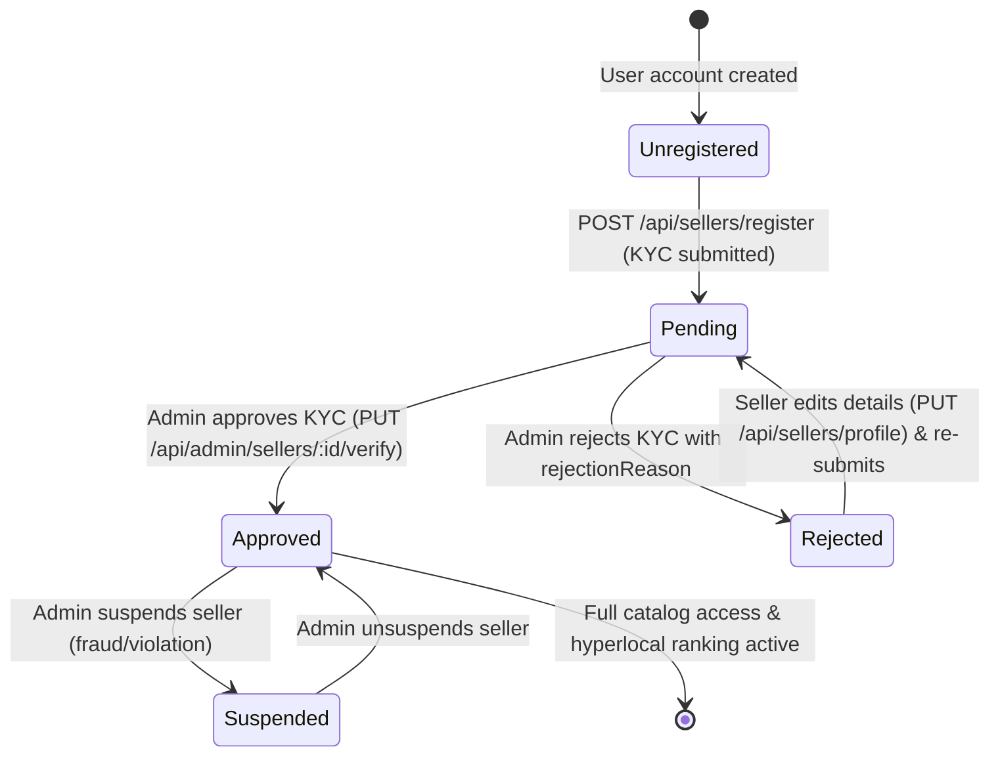
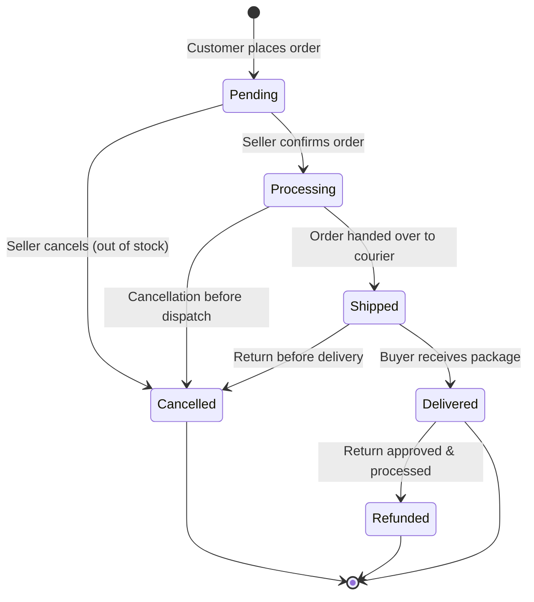
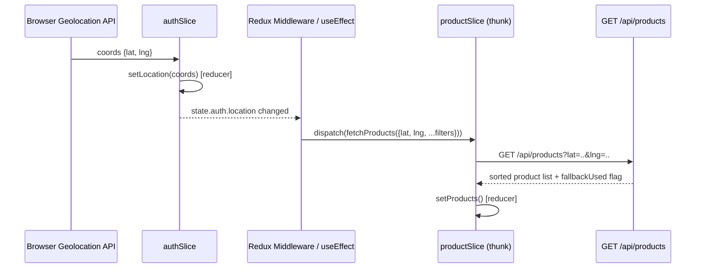

# VectorX — Architecture Document

**Version:** 1.1
**Last Updated:** 2026-08-23

---

## 1. High-Level System Architecture



**Flow summary:** The React client (three role-based panel bundles sharing a common component library) talks to a single Express REST API. The API layer is split by domain (auth, products, orders, seller, admin), each with role-scoped middleware. MongoDB stores geolocation as GeoJSON `Point` fields with `2dsphere` indexes on the `users`, `sellers`, and `products` collections, enabling native `$geoNear` aggregation for distance-based sorting. External services (Cloudinary, Stripe/PayPal/Walletmix, Nodemailer, Google Maps) are called from the API layer, never directly from the client, to keep secrets server-side.

---

## 2. Folder Structure

### 2.1 Backend (Node/Express)

```
vectorx-backend/
├── src/
│   ├── constants/
│   │   └── product.js           ✅
│   ├── config/
│   │   ├── db.js                ✅   # MongoDB connection + index verification
│   │   ├── passport.js          ✅   # Google OAuth configuration
│   │   └── cloudinary.js        ✅   # Cloudinary image upload config
│   ├── models/
│   │   ├── User.model.js        ✅   # User auth, role, location & addresses
│   │   ├── Otp.model.js         ✅   # Email OTP verification
│   │   ├── Cart.model.js        ✅   # User cart items & sync
│   │   ├── Seller.model.js      ✅   # Shop profile, KYC status, 2dsphere location
│   │   ├── Product.model.js     ✅   # Products, categories, 2dsphere location
│   │   ├── Order.model.js       ✅   # Order lifecycle, items, buyer & seller references
│   │   ├── Category.model.js    ✅   # Product categories & hierarchical tree
│   │   ├── Setting.model.js     ✅   # Platform commission, charges, coupons
│   │   └── Payment.model.js     ✅   # Payment records & status
│   ├── controllers/
│   │   ├── auth.controller.js   ✅
│   │   ├── user.controller.js   ✅
│   │   ├── product.controller.js ✅
│   │   ├── order.controller.js  ✅
│   │   ├── seller.controller.js ✅   # Dashboard metrics, products CRUD, orders, earnings
│   │   ├── admin.controller.js  ✅
│   │   └── payment.controller.js ✅
│   ├── routes/
│   │   ├── auth.routes.js       ✅
│   │   ├── user.routes.js       ✅
│   │   ├── product.routes.js    ✅
│   │   ├── order.routes.js      ✅ 
│   │   ├── seller.routes.js     ✅   # /api/sellers/* endpoints
│   │   ├── admin.routes.js      ✅
│   │   └── payment.routes.js    ✅
│   ├── middlewares/
│   │   ├── auth.middleware.js   ✅   # verifyToken
│   │   ├── role.middleware.js   ✅   # isUser, isSeller, isAdmin, isVerifiedSeller
│   │   ├── error.middleware.js  ✅   # centralized error handler
│   │   ├── validate.middleware.js ✅ # request body validation (Joi/Zod)
│   │   └── upload.middleware.js ✅   # Multer file upload handler
│   ├── services/
│   │   ├── product.service.js   ✅   # Product query/filter/geo search & creation logic
│   │   ├── geo.service.js       ✅   # $geoNear aggregation & distance calculators
│   │   ├── payment.service.js   ✅   # Payment gateway integration
│   │   ├── email.service.js     ✅   # Nodemailer wrappers
│   │   ├── otp.service.js       ✅   # OTP generation & verification
│   │   ├── refreshToken.service.js ✅
│   │   └── seller.service.js    ✅   # Seller profile & verification helpers
│   ├── utils/
│   │   ├── apiResponse.js       ✅
│   │   ├── asyncHandler.js      ✅
│   │   ├── logger.js            ✅
│   │   └── ApiError.js          ✅
│   ├── validations/
│   │   └── admin.validation.js  ✅
│   ├── app.js                   ✅   # Express app setup, middleware & route mounting
│   └── server.js                ✅   # Server entry point
├── tests/
│   ├── auth.test.js
│   ├── geo.test.js
│   └── order.test.js
├── .env
├── package.json
└── README.md
```

### 2.2 Frontend (React + Redux Toolkit)

```
vectorx-frontend/
├── public/
│   └── index.html                     # React এর এন্ট্রি HTML
├── src/
│   ├── app/                           # Redux store কনফিগারেশন
│   │   ├── store.js       ✅              # configureStore, middleware, API reducer যোগ
│   │   └── rootReducer.js   ✅           # (ঐচ্ছিক) সব slice একত্রে করা (যদি store এ সরাসরি না করি)
│   │
│   ├── features/                      # প্রতিটি ফিচার আলাদা মডিউল
│   │   ├── auth/                      # প্রমাণীকরণ (লগইন, রেজিস্টার, OTP, টোকেন)
│   │   │   ├── authSlice.js  ✅         # user, token, location, status, error
│   │   │   └── authApi.js    ✅         # লগইন, রেজিস্টার, OTP ভেরিফাই, রিফ্রেশ, ফরগট পাসওয়ার্ড
│   │   ├── user/                      # ইউজার প্রোফাইল, অ্যাড্রেস, উইশলিস্ট, অর্ডার হিস্ট্রি
│   │   │   ├── userSlice.js ✅          # প্রোফাইল, অ্যাড্রেস, উইশলিস্ট, অর্ডার লিস্ট স্টেট
│   │   │   └── userApi.js     ✅        # প্রোফাইল পড়া/আপডেট, লোকেশন আপডেট, উইশলিস্ট টগল, অর্ডার হিস্ট্রি
│   │   ├── products/                  # প্রোডাক্ট ব্রাউজিং, ফিল্টার, ডিটেইল, রিভিউ
│   │   │   ├── productSlice.js     ✅      # প্রোডাক্ট লিস্ট, ফিল্টার, পেজিনেশন, সাজানো (distance/popularity)
│   │   │   └── productApi.js        ✅     # GET /products (লোকেশনসহ), GET /products/:id, POST রিভিউ
│   │   ├── cart/                      # শপিং কার্ট (স্থানীয় ও সার্ভার সিঙ্ক)
│   │   │   └── cartSlice.js      ✅        # আইটেম, কোয়ান্টিটি, শিপিং অ্যাড্রেস, টোটাল
│   │   ├── order/                     # অর্ডার তৈরি, ট্র্যাকিং, স্ট্যাটাস ম্যানেজমেন্ট
│   │   │   ├── orderSlice.js      ✅       # বর্তমান অর্ডার, অর্ডার লিস্ট, ডিটেইল
│   │   │   └── orderApi.js          ✅     # POST /orders, GET /orders/:id, (সেলার/অ্যাডমিনের জন্য আলাদা এন্ডপয়েন্ট)
│   │   ├── payment/                   # পেমেন্ট ইন্টেন্ট ও স্ট্যাটাস
│   │   │   └── paymentSlice.js        # paymentIntent, status (idle/processing/succeeded/failed), error
│   │   ├── seller/                    # সেলার প্যানেল (ড্যাশবোর্ড, প্রোডাক্ট CRUD, অর্ডার)
│   │   │   ├── sellerSlice.js   ✅      # ড্যাশবোর্ড স্ট্যাটস, প্রোডাক্ট লিস্ট, অর্ডার লিস্ট, শপ প্রোফাইল
│   │   │   └── sellerApi.js     ✅      # সেলার রেজিস্ট্রেশন, ড্যাশবোর্ড, প্রোডাক্ট CRUD, অর্ডার স্ট্যাটাস আপডেট
│   │   └── admin/                     # অ্যাডমিন প্যানেল (সব ইউজার, সেলার, ক্যাটেগরি, সেটিংস)
│   │       ├── adminSlice.js          # ইউজার, সেলার, ক্যাটেগরি, প্ল্যাটফর্ম স্ট্যাটস, সেটিংস
│   │       └── adminApi.js            # ইউজার/সেলার ব্লক, ভেরিফাই, ক্যাটেগরি CRUD, সেটিংস আপডেট, ড্যাশবোর্ড
│   │
│   ├── components/                    # রিইউজেবল UI কম্পোনেন্ট
│   │   ├── common/                    # ছোট ছোট UI এলিমেন্ট
│   │   │   ├── Button.jsx ✅  
│   │   │   ├── Card.jsx
│   │   │   ├── Modal.jsx ✅ 
│   │   │   ├── Input.jsx ✅
│   │   │   ├── Select.jsx
│   │   │   ├── Table.jsx
│   │   │   ├── Badge.jsx  ✅
│   │   │   └── Toast.jsx (বা react-toastify ব্যবহার)
│   │   ├── layout/                    # লেআউট কম্পোনেন্ট (Navbar, Sidebar, Footer)
│   │   │   ├── UserLayout.jsx ✅        # ইউজার প্যানেলের লেআউট (Navbar + Footer + Outlet)
│   │   │   ├── SellerLayout.jsx  ✅     # সেলার প্যানেল (Sidebar + Topbar + Outlet)
│   │   │   ├── AdminLayout.jsx   ✅     # অ্যাডমিন প্যানেল (Sidebar + Topbar + Outlet)
│   │   │   ├── Navbar.jsx       ✅      # ইউজার ন্যাভবার (লোগো, সার্চ, কার্ট, ড্রপডাউন)
│   │   │   ├── SellerSidebar.jsx   ✅   # সেলার সাইডবার মেনু
│   │   │   ├── SellerTopbar.jsx    ✅   # সেলার টপবার (নোটিফিকেশন, প্রোফাইল)
│   │   │   ├── AdminSidebar.jsx    ✅   # অ্যাডমিন সাইডবার
│   │   │   ├── AdminTopbar.jsx     ✅   # অ্যাডমিন টপবার
│   │   │   └── Footer.jsx     ✅        # ফুটার (শুধু ইউজার প্যানেলে)
│   │   └── location/                  # লোকেশন সংক্রান্ত UI
│   │       ├── LocationPrompt.jsx  ✅   # লোকেশন অনুমতি চাওয়ার পপআপ
│   │       ├── PincodeInput.jsx    ✅   # ম্যানুয়াল পিনকোড ইনপুট
│   │       └── AddressAutocomplete.jsx ✅  # গুগল ম্যাপস অটোকমপ্লিট
│   │
│   ├── pages/                         # পেজ লেভেল কম্পোনেন্ট (প্রতিটি রাউটের জন্য)
│   │   ├── auth/                      # অথেন্টিকেশন পেজ
│   │   │   ├── Login.jsx ✅
│   │   │   ├── Register.jsx  ✅
│   │   │   ├── VerifyOtp.jsx  ✅
│   │   │   └── ForgotPassword.jsx ✅
            └──  GoogleCallback.jsx ✅
│   │   ├── user/                      # ইউজার প্যানেল পেজ
│   │   │   ├── Home.jsx ✅
│   │   │   ├── ProductListing.jsx ✅
│   │   │   ├── ProductDetails.jsx ✅
│   │   │   ├── Cart.jsx  ✅
│   │   │   ├── Checkout.jsx ✅
│   │   │   ├── Profile.jsx ✅
│   │   │   └── OrderHistory.jsx ✅
│   │   ├── seller/                    # সেলার প্যানেল পেজ
│   │   │   ├── SellerDashboard.jsx ✅ # ড্যাশবোর্ড ওভারভিউ, মেট্রিক্স ও আর্নিংস
│   │   │   ├── Products.jsx        ✅ # প্রোডাক্ট লিস্ট + অ্যাড/এডিট/ডিলিট মডেল
│   │   │   ├── Orders.jsx          ✅ # অর্ডার লিস্ট + স্ট্যাটাস আপডেট
│   │   │   ├── ShopProfile.jsx     ✅ # শপ প্রোফাইল, লোকেশন ও ব্যাংক ইনফো
│   │   │   └── RegisterSeller.jsx  ✅ # সেলার অনবোর্ডিং রেজিস্ট্রেশন ফর্ম
│   │   ├── admin/                     # অ্যাডমিন প্যানেল পেজ
│   │   │   ├── Dashboard.jsx       ✅ # প্ল্যাটফর্ম ড্যাশবোর্ড, মেট্রিক্স ও রেভেনিউ
│   │   │   ├── Users.jsx           ✅ # ইউজার ম্যানেজমেন্ট ও ব্লক/আনব্লক
│   │   │   ├── Sellers.jsx         ✅ # সেলার KYC ভেরিফিকেশন ও সাসপেন্ড
│   │   │   ├── Categories.jsx      ✅ # ক্যাটেগরি হায়ারার্কি ও SEO
│   │   │   ├── Orders.jsx          ✅ # প্ল্যাটফর্ম অর্ডার ও বিরোধ নিষ্পত্তি
│   │   │   └── Settings.jsx        ✅ # গ্লোবাল সেটিংস, কমিশন ও কুপন
│   │   └── Unauthorized.jsx ✅        # ৪০৩ পেজ (অনুমতি নেই)
│   │
│   ├── routes/                        # রাউট কনফিগারেশন
│   │   ├── AppRoutes.jsx       ✅     # সব রাউটের প্যারেন্ট (BrowserRouter এর ভেতর)
│   │   ├── ProtectedRoute.jsx  ✅     # রোল-বেসড গার্ড (টোকেন ও রোল চেক)
│   │   ├── UserRoutes.jsx             # (ঐচ্ছিক) ইউজার রাউট গ্রুপ
│   │   ├── SellerRoutes.jsx    ✅     # সেলার রাউট গ্রুপ
│   │   └── AdminRoutes.jsx            # (ঐচ্ছিক) অ্যাডমিন রাউট গ্রুপ
│   │
│   ├── hooks/                         # কাস্টম হুক
│   │   ├── useGeolocation.js          # ব্রাউজার জিওলোকেশন + পিনকোড ফ্যালব্যাক
│   │   ├── useAuth.js                 # auth স্টেট ও লগআউট ফাংশন
│   │   └── useToast.js                # টোস্ট মেসেজ দেখানোর হুক (যদি react-toastify না ব্যবহার করি)
│   │
│   ├── services/                      # বাহ্যিক সার্ভিস কনফিগারেশন
│   │   └── axiosInstance.js           # Axios instance (baseURL, interceptors)
│   │
│   ├── utils/                         # ইউটিলিটি ফাংশন ও কনস্ট্যান্ট
│   │   ├── constants.js               # রোল, অর্ডার স্ট্যাটাস, পেমেন্ট স্ট্যাটাস ইত্যাদি
│   │   └── helpers.js                 # ফরম্যাটিং (টাকা, তারিখ), ভ্যালিডেশন হেল্পার
│   │
│   ├── styles/                        # স্টাইলিং থিম
│   │   └── theme.js                   # Tailwind কাস্টম থিম (Figma টোকেন ইম্পোর্ট)
│   │
│   ├── App.jsx                        # অ্যাপের রুট কম্পোনেন্ট (BrowserRouter + ToastContainer)
│   ├── main.jsx                       # ReactDOM.render (Provider দিয়ে র‍্যাপ)
│   └── index.css                      # Tailwind ডিরেক্টিভস
│
├── .env.example                       # এনভায়রনমেন্ট ভেরিয়েবলের টেমপ্লেট
├── .eslintrc.json                     # ESLint কনফিগ (rules.md অনুযায়ী)
├── .prettierrc                        # Prettier কনফিগ
├── tailwind.config.js                 # Tailwind কাস্টমাইজেশন
├── postcss.config.js
├── package.json
└── README.md
```
---

## 3. Database Schema (Mongoose Models)

### 3.1 User Model
```javascript
const userSchema = new mongoose.Schema({
  name: { type: String, required: true, trim: true },
  email: { type: String, required: true, unique: true, lowercase: true },
  phone: { type: String, unique: true, sparse: true },
  password: { type: String, required: true, select: false },
  role: { type: String, enum: ['user', 'seller', 'admin'], default: 'user' },
  isVerified: { type: Boolean, default: false }, // email/phone OTP verified
  location: {
    type: { type: String, enum: ['Point'], default: 'Point' },
    coordinates: { type: [Number], default: [0, 0] } // [longitude, latitude]
  },
  addresses: [{
    label: String,          // "Home", "Work"
    line1: String,
    city: String,
    pincode: String,
    coordinates: [Number],
    isDefault: { type: Boolean, default: false }
  }],
  wishlist: [{ type: mongoose.Schema.Types.ObjectId, ref: 'Product' }],
  isBlocked: { type: Boolean, default: false }
}, { timestamps: true });

userSchema.index({ location: '2dsphere' });
```

### 3.2 Seller Model
> Design choice: separate collection referencing `User` (see `memory.md` §1 for rationale), rather than embedding seller fields in every user document.

```javascript
const sellerSchema = new mongoose.Schema({
  user: { type: mongoose.Schema.Types.ObjectId, ref: 'User', required: true, unique: true },
  shopName: { type: String, required: true },
  shopAddress: {
    line1: String,
    city: String,
    pincode: String
  },
  location: {
    type: { type: String, enum: ['Point'], default: 'Point' },
    coordinates: { type: [Number], required: true } // [longitude, latitude]
  },
  gstNumber: { type: String },
  panNumber: { type: String },
  bankDetails: {
    accountHolderName: String,
    accountNumber: { type: String, select: false },
    ifsc: String
  },
  isVerified: { type: Boolean, default: false },   // admin KYC approval
  verificationStatus: { type: String, enum: ['pending', 'approved', 'rejected'], default: 'pending' },
  rejectionReason: { type: String }
}, { timestamps: true });

sellerSchema.index({ location: '2dsphere' });
```

### 3.3 Product Model
```javascript
const productSchema = new mongoose.Schema({
  name: { type: String, required: true },
  description: { type: String },
  price: { type: Number, required: true, min: 0 },
  category: { type: mongoose.Schema.Types.ObjectId, ref: 'Category', required: true },
  images: [{ url: String, publicId: String }], // Cloudinary
  sellerId: { type: mongoose.Schema.Types.ObjectId, ref: 'Seller', required: true },
  stock: { type: Number, default: 0, min: 0 },
  lowStockThreshold: { type: Number, default: 5 },
  rating: { average: { type: Number, default: 0 }, count: { type: Number, default: 0 } },
  location: {
    type: { type: String, enum: ['Point'], default: 'Point' },
    coordinates: { type: [Number], required: true } // inherited from seller at creation time
  },
  isActive: { type: Boolean, default: true }
}, { timestamps: true });

productSchema.index({ location: '2dsphere' });
productSchema.index({ category: 1, isActive: 1 });
```

### 3.4 Order Model
```javascript
const orderSchema = new mongoose.Schema({
  userId: { type: mongoose.Schema.Types.ObjectId, ref: 'User', required: true },
  sellerId: { type: mongoose.Schema.Types.ObjectId, ref: 'Seller', required: true },
  items: [{
    productId: { type: mongoose.Schema.Types.ObjectId, ref: 'Product' },
    name: String,
    price: Number,
    quantity: Number
  }],
  totalAmount: { type: Number, required: true },
  shippingAddress: {
    line1: String,
    city: String,
    pincode: String,
    coordinates: [Number]
  },
  status: {
    type: String,
    enum: ['Pending', 'Processing', 'Shipped', 'Delivered', 'Cancelled', 'Refunded'],
    default: 'Pending'
  },
  paymentMethod: { type: String, enum: ['stripe', 'paypal'] },
  paymentStatus: { type: String, enum: ['pending', 'paid', 'failed', 'refunded'], default: 'pending' },
  paymentReference: { type: String }
}, { timestamps: true });

orderSchema.index({ userId: 1, createdAt: -1 });
orderSchema.index({ sellerId: 1, status: 1 });
```

> **Note on multi-seller carts:** When a buyer's cart contains products from multiple sellers, checkout creates one `Order` document per seller (all sharing a `checkoutSessionId` for payment reconciliation), so seller-side order management always operates on a single-seller order.

### 3.5 Category Model
```javascript
const categorySchema = new mongoose.Schema({
  name: { type: String, required: true, unique: true },
  slug: { type: String, required: true, unique: true },
  parent: { type: mongoose.Schema.Types.ObjectId, ref: 'Category', default: null }, // null = top-level
  isActive: { type: Boolean, default: true }
}, { timestamps: true });
```

---

## 4. API Endpoint Reference

### 4.1 Auth
| Method | Endpoint | Description | Auth |
|---|---|---|---|
| POST | `/api/auth/register` | Register with role, email/phone, password | Public |
| POST | `/api/auth/verify-otp` | Verify OTP sent to email/phone | Public |
| POST | `/api/auth/login` | Login, returns JWT | Public |
| POST | `/api/auth/refresh` | Refresh access token | Public (refresh token) |
| POST | `/api/auth/forgot-password` | Trigger reset email | Public |

**Example — `POST /api/auth/login`**
```json
// Request
{ "email": "farhana@example.com", "password": "••••••••" }

// Response 200
{
  "success": true,
  "data": {
    "token": "eyJhbGciOi...",
    "user": { "id": "665f...", "name": "Farhana", "role": "user", "isVerified": true }
  }
}
```

### 4.2 User
| Method | Endpoint | Description | Auth |
|---|---|---|---|
| GET | `/api/users/profile` | Get logged-in user's profile | User |
| PUT | `/api/users/profile` | Update name/profile fields | User |
| PUT | `/api/users/location` | Update stored lat/lng or pincode | User |
| GET | `/api/users/orders` | Get order history | User |
| POST | `/api/users/wishlist/:productId` | Add/remove wishlist item | User |

### 4.3 Products
| Method | Endpoint | Description | Auth |
|---|---|---|---|
| GET | `/api/products?lat=X&lng=Y&category=&minPrice=&maxPrice=&page=` | Location-sorted product list | Public |
| GET | `/api/products/:id` | Product details | Public |
| POST | `/api/products/:id/reviews` | Submit rating/review | User (must have Delivered order) |

**Example — `GET /api/products?lat=23.8103&lng=90.4125&category=electronics&page=1`**
```json
// Response 200
{
  "success": true,
  "data": {
    "products": [
      {
        "id": "665f1a...",
        "name": "Wireless Earbuds",
        "price": 1499,
        "distanceKm": 1.8,
        "sellerId": "665e02...",
        "shopName": "TechHub Dhanmondi",
        "rating": { "average": 4.3, "count": 27 },
        "images": ["https://res.cloudinary.com/.../earbuds.jpg"]
      }
    ],
    "sortedBy": "distance",
    "fallbackUsed": false
  },
  "pagination": { "page": 1, "totalPages": 6, "totalResults": 118 }
}
```
> If `lat`/`lng` are omitted or invalid, `sortedBy` becomes `"popularity"` and `fallbackUsed: true` — this is how the frontend can surface a "showing popular products near your area is unavailable" banner (FR-8).

### 4.4 Seller API Reference

| Method | Endpoint | Description | Auth Required | Permissions / Status |
|---|---|---|---|---|
| POST | `/api/sellers/register` | Create seller profile with GPS coordinates & bank details | `verifyToken` | User (becomes `role: 'seller'`) |
| GET | `/api/sellers/profile` | Get store profile, coordinates, KYC status, tax & bank info | `verifyToken` | User / Seller |
| PUT | `/api/sellers/profile` | Update shop details, address, coordinates, tax & bank info | `verifyToken`, `checkSellerExists` | Seller (syncs product coordinates) |
| GET | `/api/sellers/dashboard` | Orders count, revenue, top products, low stock alerts, recent orders | `verifyToken`, `isSeller`, `checkSellerExists` | Seller (graceful zero-state if pending) |
| GET | `/api/sellers/earnings` | Period revenue, order count, AOV & daily breakdown (`?period=week\|month\|year`) | `verifyToken`, `isSeller`, `checkSellerExists` | Seller (graceful zero-state if pending) |
| GET | `/api/sellers/products` | Paginated catalog with search, category, status & stock filters | `verifyToken`, `isSeller`, `isVerifiedSeller` | Verified Seller |
| POST | `/api/sellers/products` | Create product (inherits shop's 2dsphere coordinates) | `verifyToken`, `isSeller`, `isVerifiedSeller` | Verified Seller |
| PUT | `/api/sellers/products/:id` | Update product details, pricing, compare price, stock, visibility | `verifyToken`, `isSeller`, `isVerifiedSeller` | Verified Seller (owns product) |
| DELETE | `/api/sellers/products/:id` | Delete product from store catalog | `verifyToken`, `isSeller`, `isVerifiedSeller` | Verified Seller (owns product) |
| GET | `/api/sellers/orders` | List incoming orders with status filter & customer details | `verifyToken`, `isSeller`, `isVerifiedSeller` | Verified Seller |
| PUT | `/api/sellers/orders/:id/status` | Advance order lifecycle status | `verifyToken`, `isSeller`, `isVerifiedSeller` | Verified Seller (owns order) |

#### 4.4.1 Seller KYC Verification Lifecycle


#### 4.4.2 Seller Order Status State Machine


#### 4.4.3 Example — `GET /api/sellers/dashboard`
```json
// Response 200 (Verified Seller)
{
  "success": true,
  "data": {
    "totalOrders": 42,
    "totalRevenue": 62990,
    "pendingOrders": 3,
    "totalProducts": 18,
    "topProducts": [
      {
        "productId": "665f1a...",
        "name": "Wireless Noise Cancelling Earbuds",
        "quantity": 24,
        "revenue": 35976
      }
    ],
    "lowStockProducts": [
      {
        "_id": "665f1b...",
        "name": "Bluetooth Speaker Mini",
        "stock": 2,
        "lowStockThreshold": 5
      }
    ],
    "recentOrders": [
      {
        "_id": "6660a1...",
        "totalAmount": 2998,
        "status": "Pending",
        "createdAt": "2026-08-23T10:30:00.000Z",
        "userId": { "name": "Bishal Roy", "email": "bishal@example.com" },
        "items": [{ "name": "Wireless Noise Cancelling Earbuds", "quantity": 2, "price": 1499 }]
      }
    ],
    "verificationStatus": "approved",
    "isVerified": true
  }
}
```

### 4.5 Admin API Reference
| Method | Endpoint | Description | Auth Required |
|---|---|---|---|
| GET | `/api/admin/dashboard` | Platform-wide analytics (GMV, total users, sellers, orders, recent transactions) | Admin |
| GET | `/api/admin/users` | List and search users with role, email verification & pagination | Admin |
| GET | `/api/admin/users/:id` | Get detailed user profile with addresses and order counts | Admin |
| PUT | `/api/admin/users/:id/block` | Block or unblock user account | Admin |
| DELETE | `/api/admin/users/:id` | Permanently delete user account | Admin |
| GET | `/api/admin/sellers` | List merchants with verification status filter (`pending`, `approved`, `rejected`) | Admin |
| GET | `/api/admin/sellers/:id` | Get detailed shop profile, banking details & 2dsphere location | Admin |
| PUT | `/api/admin/sellers/:id/verify` | Approve or reject seller KYC application with mandatory rejection reason | Admin |
| PUT | `/api/admin/sellers/:id/suspend` | Suspend or unsuspend store listings | Admin |
| GET | `/api/admin/categories` | List all categories with parent hierarchies and active statuses | Admin |
| POST | `/api/admin/categories` | Create category with slug, image, sort order and SEO metadata | Admin |
| PUT | `/api/admin/categories/:id` | Update category properties, parent mapping, or SEO | Admin |
| DELETE | `/api/admin/categories/:id` | Delete category (supports `?force=true` for cascading subcategories) | Admin |
| GET | `/api/admin/orders` | View all platform orders with status, payment and date range filters | Admin |
| GET | `/api/admin/orders/:id` | View comprehensive order payload, shipping address & item details | Admin |
| PUT | `/api/admin/orders/:id/status` | Override order lifecycle status for dispute resolution | Admin |
| GET | `/api/admin/settings` | Retrieve platform global config (delivery charges, commission %, coupons) | Admin |
| PUT | `/api/admin/settings` | Update platform delivery charges, commission rate % and coupon codes | Admin |

---

## 5. Redux State Structure & Data Flow

### 5.1 Store Shape
```javascript
{
  auth: {
    user: null,          // { id, name, role, isVerified }
    token: null,
    location: { lat: null, lng: null, pincode: null, source: null }, // source: 'geo' | 'manual'
    status: 'idle'        // 'idle' | 'loading' | 'succeeded' | 'failed'
  },
  products: {
    items: [],
    filters: { category: null, minPrice: null, maxPrice: null },
    sortedBy: 'distance',  // 'distance' | 'popularity'
    fallbackUsed: false,
    currentProduct: null,
    pagination: { page: 1, totalPages: 1 },
    status: 'idle'
  },
  cart: {
    items: [],            // grouped implicitly by sellerId for checkout
    shippingAddress: null,
    total: 0
  },
  seller: {
    profile: null,        // { _id, shopName, shopAddress, location, verificationStatus, ... }
    dashboardStats: null, // { totalOrders, totalRevenue, pendingOrders, totalProducts, topProducts, lowStockProducts, recentOrders }
    earnings: null,       // { totalEarnings, orderCount, averageOrderValue, dailyEarnings }
    products: [],         // array of seller's products
    productPagination: { page: 1, limit: 20, total: 0, totalPages: 1 },
    orders: [],           // array of incoming customer orders
    orderPagination: { page: 1, limit: 20, total: 0, totalPages: 1 },
    status: 'idle',       // 'idle' | 'loading' | 'succeeded' | 'failed'
    actionLoading: false,
    error: null
  },
  admin: {
    users: [],
    sellers: [],
    categories: [],
    platformStats: null,
    status: 'idle'
  }
}
```

### 5.2 Location → Product Re-fetch Flow



**Implementation pattern:** A `useEffect` in the top-level layout (or an RTK listener middleware) watches `state.auth.location`. Whenever it changes — from geolocation resolving, manual pincode entry, or profile address updates — it dispatches `fetchProducts` (an `createAsyncThunk`, or an RTK Query hook re-triggered via a changed query key) with the new coordinates plus the currently active filters. This keeps location as the **single source of truth** that cascades into product sorting, rather than duplicating location state inside `productSlice`.

### 5.3 RTK Query (Optional Layer)
If using RTK Query instead of hand-written thunks, `productApi.js` defines:
```javascript
getProducts: builder.query({
  query: ({ lat, lng, category, minPrice, maxPrice, page }) =>
    `/products?lat=${lat}&lng=${lng}&category=${category ?? ''}&minPrice=${minPrice ?? ''}&maxPrice=${maxPrice ?? ''}&page=${page ?? 1}`,
  providesTags: ['Product']
})
```
The query key naturally includes `lat`/`lng`, so any component calling `useGetProductsQuery({ lat, lng, ...filters })` automatically re-fetches when location changes — no manual dispatch needed. This is the recommended approach for new development (see `memory.md` §1 for the RTK Query vs. thunk trade-off).

---

## 6. Security Architecture

| Layer | Control |
|---|---|
| Authentication | JWT (short-lived access token + longer-lived refresh token), signed with `JWT_SECRET` from env |
| Authorization | `role.middleware.js` exposes `isUser`, `isSeller`, `isAdmin`; every protected route composes `verifyToken` + the relevant role guard |
| Password Storage | bcrypt hashing (cost factor ≥ 10), `password` field excluded from queries by default (`select: false`) |
| Input Validation | Request bodies validated at the route boundary (Joi/Zod schemas) before hitting controllers |
| Secrets Management | All API keys (Stripe, PayPal, Cloudinary, Google Maps, SMTP) loaded via `.env`, never committed; `.env.example` documents required keys with placeholder values |
| CORS | Explicit allow-list of frontend origin(s) in `app.js`; credentials mode enabled only for the known frontend domain |
| Rate Limiting | `express-rate-limit` on `/api/auth/*` to mitigate brute-force and OTP abuse |
| Data Ownership Checks | Seller routes verify `req.user.id` matches the resource's owning seller before allowing mutation (prevents IDOR) |
| Geospatial Input Validation | Coordinates validated as `[-180,180]` longitude / `[-90,90]` latitude ranges before being persisted, preventing malformed `2dsphere` index entries |
| Transport | HTTPS enforced at the hosting/CDN layer (Vercel/Render both terminate TLS by default) |

---

*Next document: `phases.md` — phased delivery plan with weekly timelines.*
