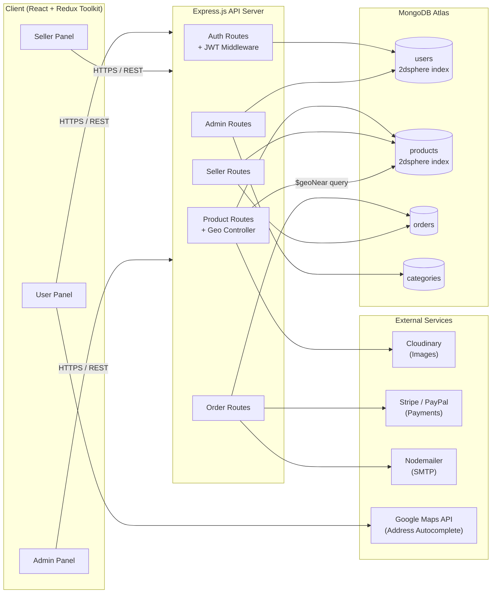
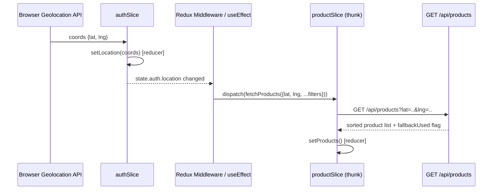

# VectorX — Architecture Document

**Version:** 1.0
**Last Updated:** 2026-08-11

---

## 1. High-Level System Architecture



**Flow summary:** The React client (three role-based panel bundles sharing a common component library) talks to a single Express REST API. The API layer is split by domain (auth, products, orders, seller, admin), each with role-scoped middleware. MongoDB stores geolocation as GeoJSON `Point` fields with `2dsphere` indexes on the `users` and `products` collections, enabling native `$geoNear` aggregation for distance-based sorting. External services (Cloudinary, Stripe/PayPal, Nodemailer, Google Maps) are called from the API layer, never directly from the client, to keep secrets server-side.

---

## 2. Folder Structure

### 2.1 Backend (Node/Express)

```
vectorx-backend/
├── src/
│   ├── config/
│   │   ├── db.js    ✅   # MongoDB connection + index verification
|   |   ├── passport.js ✅
│   │   ├── cloudinary.js
│   │                  
│   ├── models/
│   │   ├── User.model.js   ✅
│   │   ├── Seller.model.js        # extends/references User
│   │   ├── Product.model.js
│   │   ├── Order.model.js
│   │   └── Category.model.js
│   ├── controllers/
│   │   ├── auth.controller.js ✅
│   │   ├── user.controller.js
│   │   ├── product.controller.js
│   │   ├── order.controller.js
│   │   ├── seller.controller.js
│   │   └── admin.controller.js
│   ├── routes/
│   │   ├── auth.routes.js ✅
│   │   ├── user.routes.js
│   │   ├── product.routes.js
│   │   ├── order.routes.js
│   │   ├── seller.routes.js
│   │   └── admin.routes.js
│   ├── middlewares/
│   │   ├── auth.middleware.js  ✅  # verifyToken
│   │   ├── role.middleware.js     # isUser, isSeller, isAdmin
│   │   ├── error.middleware.js    # centralized error handler
│   │   └── validate.middleware.js # request body validation (Joi/Zod)
│   ├── services/
│   │   ├── geo.service.js         # $geoNear query builder + fallback logic
│   │   ├── payment.service.js     # Stripe/PayPal wrappers
│   │   ├── email.service.js       # Nodemailer wrappers
│   │   └── otp.service.js ✅
|   |           
│   ├── utils/
│   │   ├── apiResponse.js
│   │   ├── asyncHandler.js
│   │   └── logger.js
│   ├── app.js                     # Express app setup, middleware mounting
│   └── server.js                  # entry point
├── tests/
│   ├── auth.test.js
│   ├── geo.test.js
│   └── order.test.js
├── .env
├── package.json
└── README.md
```

### 2.2 Frontend (React + Redux Toolkit)

```
vectorx-frontend/
├── src/
│   ├── app/
│   │   └── store.js                # configureStore, root reducer
│   ├── features/
│   │   ├── auth/
│   │   │   ├── authSlice.js
│   │   │   └── authApi.js          # RTK Query endpoints (optional)
│   │   ├── products/
│   │   │   ├── productSlice.js
│   │   │   └── productApi.js
│   │   ├── cart/
│   │   │   └── cartSlice.js
│   │   ├── seller/
│   │   │   └── sellerSlice.js
│   │   └── admin/
│   │       └── adminSlice.js
│   ├── components/
│   │   ├── common/                 # Button, Card, Modal, Input, Table
│   │   ├── layout/                 # Navbar, Sidebar, Footer
│   │   └── location/               # LocationPrompt, PincodeInput
│   ├── pages/
│   │   ├── user/                   # Home, ProductListing, ProductDetails, Cart, Checkout, Profile
│   │   ├── seller/                 # Dashboard, Products, Orders, ShopProfile
│   │   └── admin/                  # Dashboard, Users, Sellers, Categories, Orders, Settings
│   ├── routes/
│   │   ├── UserRoutes.jsx
│   │   ├── SellerRoutes.jsx
│   │   ├── AdminRoutes.jsx
│   │   └── ProtectedRoute.jsx      # role-based route guard
│   ├── hooks/
│   │   ├── useGeolocation.js
│   │   └── useAuth.js
│   ├── services/
│   │   └── axiosInstance.js        # base API client with interceptors
│   ├── styles/
│   │   └── theme.js                # Tailwind/MUI theme tokens from Figma
│   ├── App.jsx
│   └── main.jsx
├── public/
├── .env.example
├── package.json
└── README.md
```

---

## 3. Database Schema (Mongoose Models)

### 3.1 User Model
```javascript
const userSchema = new mongoose.Schema({
  name: { type: String, required: true, trim: true },
  email: { type: String, required: true, unique: true, lowercase: true },
  phone: { type: String, unique: true, sparse: true },
  password: { type: String, required: true, select: false },
  role: { type: String, enum: ['user', 'seller', 'admin'], default: 'user' },
  isVerified: { type: Boolean, default: false }, // email/phone OTP verified
  location: {
    type: { type: String, enum: ['Point'], default: 'Point' },
    coordinates: { type: [Number], default: [0, 0] } // [longitude, latitude]
  },
  addresses: [{
    label: String,          // "Home", "Work"
    line1: String,
    city: String,
    pincode: String,
    coordinates: [Number],
    isDefault: { type: Boolean, default: false }
  }],
  wishlist: [{ type: mongoose.Schema.Types.ObjectId, ref: 'Product' }],
  isBlocked: { type: Boolean, default: false }
}, { timestamps: true });

userSchema.index({ location: '2dsphere' });
```

### 3.2 Seller Model
> Design choice: separate collection referencing `User` (see `memory.md` §1 for rationale), rather than embedding seller fields in every user document.

```javascript
const sellerSchema = new mongoose.Schema({
  user: { type: mongoose.Schema.Types.ObjectId, ref: 'User', required: true, unique: true },
  shopName: { type: String, required: true },
  shopAddress: {
    line1: String,
    city: String,
    pincode: String
  },
  location: {
    type: { type: String, enum: ['Point'], default: 'Point' },
    coordinates: { type: [Number], required: true } // [longitude, latitude]
  },
  gstNumber: { type: String },
  panNumber: { type: String },
  bankDetails: {
    accountHolderName: String,
    accountNumber: { type: String, select: false },
    ifsc: String
  },
  isVerified: { type: Boolean, default: false },   // admin KYC approval
  verificationStatus: { type: String, enum: ['pending', 'approved', 'rejected'], default: 'pending' },
  rejectionReason: { type: String }
}, { timestamps: true });

sellerSchema.index({ location: '2dsphere' });
```

### 3.3 Product Model
```javascript
const productSchema = new mongoose.Schema({
  name: { type: String, required: true },
  description: { type: String },
  price: { type: Number, required: true, min: 0 },
  category: { type: mongoose.Schema.Types.ObjectId, ref: 'Category', required: true },
  images: [{ url: String, publicId: String }], // Cloudinary
  sellerId: { type: mongoose.Schema.Types.ObjectId, ref: 'Seller', required: true },
  stock: { type: Number, default: 0, min: 0 },
  lowStockThreshold: { type: Number, default: 5 },
  rating: { average: { type: Number, default: 0 }, count: { type: Number, default: 0 } },
  location: {
    type: { type: String, enum: ['Point'], default: 'Point' },
    coordinates: { type: [Number], required: true } // inherited from seller at creation time
  },
  isActive: { type: Boolean, default: true }
}, { timestamps: true });

productSchema.index({ location: '2dsphere' });
productSchema.index({ category: 1, isActive: 1 });
```

### 3.4 Order Model
```javascript
const orderSchema = new mongoose.Schema({
  userId: { type: mongoose.Schema.Types.ObjectId, ref: 'User', required: true },
  sellerId: { type: mongoose.Schema.Types.ObjectId, ref: 'Seller', required: true },
  items: [{
    productId: { type: mongoose.Schema.Types.ObjectId, ref: 'Product' },
    name: String,
    price: Number,
    quantity: Number
  }],
  totalAmount: { type: Number, required: true },
  shippingAddress: {
    line1: String,
    city: String,
    pincode: String,
    coordinates: [Number]
  },
  status: {
    type: String,
    enum: ['Pending', 'Processing', 'Shipped', 'Delivered', 'Cancelled', 'Refunded'],
    default: 'Pending'
  },
  paymentMethod: { type: String, enum: ['stripe', 'paypal'] },
  paymentStatus: { type: String, enum: ['pending', 'paid', 'failed', 'refunded'], default: 'pending' },
  paymentReference: { type: String }
}, { timestamps: true });

orderSchema.index({ userId: 1, createdAt: -1 });
orderSchema.index({ sellerId: 1, status: 1 });
```

> **Note on multi-seller carts:** When a buyer's cart contains products from multiple sellers, checkout creates one `Order` document per seller (all sharing a `checkoutSessionId` for payment reconciliation), so seller-side order management always operates on a single-seller order.

### 3.5 Category Model
```javascript
const categorySchema = new mongoose.Schema({
  name: { type: String, required: true, unique: true },
  slug: { type: String, required: true, unique: true },
  parent: { type: mongoose.Schema.Types.ObjectId, ref: 'Category', default: null }, // null = top-level
  isActive: { type: Boolean, default: true }
}, { timestamps: true });
```

---

## 4. API Endpoint Reference

### 4.1 Auth
| Method | Endpoint | Description | Auth |
|---|---|---|---|
| POST | `/api/auth/register` | Register with role, email/phone, password | Public |
| POST | `/api/auth/verify-otp` | Verify OTP sent to email/phone | Public |
| POST | `/api/auth/login` | Login, returns JWT | Public |
| POST | `/api/auth/refresh` | Refresh access token | Public (refresh token) |
| POST | `/api/auth/forgot-password` | Trigger reset email | Public |

**Example — `POST /api/auth/login`**
```json
// Request
{ "email": "farhana@example.com", "password": "••••••••" }

// Response 200
{
  "success": true,
  "data": {
    "token": "eyJhbGciOi...",
    "user": { "id": "665f...", "name": "Farhana", "role": "user", "isVerified": true }
  }
}
```

### 4.2 User
| Method | Endpoint | Description | Auth |
|---|---|---|---|
| GET | `/api/users/profile` | Get logged-in user's profile | User |
| PUT | `/api/users/profile` | Update name/profile fields | User |
| PUT | `/api/users/location` | Update stored lat/lng or pincode | User |
| GET | `/api/users/orders` | Get order history | User |
| POST | `/api/users/wishlist/:productId` | Add/remove wishlist item | User |

### 4.3 Products
| Method | Endpoint | Description | Auth |
|---|---|---|---|
| GET | `/api/products?lat=X&lng=Y&category=&minPrice=&maxPrice=&page=` | Location-sorted product list | Public |
| GET | `/api/products/:id` | Product details | Public |
| POST | `/api/products/:id/reviews` | Submit rating/review | User (must have Delivered order) |

**Example — `GET /api/products?lat=23.8103&lng=90.4125&category=electronics&page=1`**
```json
// Response 200
{
  "success": true,
  "data": {
    "products": [
      {
        "id": "665f1a...",
        "name": "Wireless Earbuds",
        "price": 1499,
        "distanceKm": 1.8,
        "sellerId": "665e02...",
        "shopName": "TechHub Dhanmondi",
        "rating": { "average": 4.3, "count": 27 },
        "images": ["https://res.cloudinary.com/.../earbuds.jpg"]
      }
    ],
    "sortedBy": "distance",
    "fallbackUsed": false
  },
  "pagination": { "page": 1, "totalPages": 6, "totalResults": 118 }
}
```
> If `lat`/`lng` are omitted or invalid, `sortedBy` becomes `"popularity"` and `fallbackUsed: true` — this is how the frontend can surface a "showing popular products near your area is unavailable" banner (FR-8).

### 4.4 Seller
| Method | Endpoint | Description | Auth |
|---|---|---|---|
| POST | `/api/seller/register` | Create seller profile (pending verification) | User |
| GET | `/api/seller/dashboard` | Orders/revenue/top-products summary | Seller (verified) |
| GET, POST | `/api/seller/products` | List / create products | Seller (verified) |
| PUT, DELETE | `/api/seller/products/:id` | Update / delete own product | Seller (owns product) |
| GET | `/api/seller/orders` | List incoming orders | Seller |
| PUT | `/api/seller/orders/:id/status` | Update order status | Seller (owns order) |

### 4.5 Admin
| Method | Endpoint | Description | Auth |
|---|---|---|---|
| GET | `/api/admin/dashboard` | Platform-wide stats | Admin |
| GET | `/api/admin/users` | List/filter users | Admin |
| PUT | `/api/admin/users/:id/block` | Block/unblock user | Admin |
| GET | `/api/admin/sellers` | List sellers (filter by verificationStatus) | Admin |
| PUT | `/api/admin/sellers/:id/verify` | Approve/reject seller KYC | Admin |
| GET, POST, PUT, DELETE | `/api/admin/categories` | Manage categories | Admin |
| GET | `/api/admin/orders` | View all orders (dispute oversight) | Admin |
| PUT | `/api/admin/settings` | Update delivery charge / commission / coupons | Admin |

---

## 5. Redux State Structure & Data Flow

### 5.1 Store Shape
```javascript
{
  auth: {
    user: null,          // { id, name, role, isVerified }
    token: null,
    location: { lat: null, lng: null, pincode: null, source: null }, // source: 'geo' | 'manual'
    status: 'idle'        // 'idle' | 'loading' | 'succeeded' | 'failed'
  },
  products: {
    items: [],
    filters: { category: null, minPrice: null, maxPrice: null },
    sortedBy: 'distance',  // 'distance' | 'popularity'
    fallbackUsed: false,
    currentProduct: null,
    pagination: { page: 1, totalPages: 1 },
    status: 'idle'
  },
  cart: {
    items: [],            // grouped implicitly by sellerId for checkout
    shippingAddress: null,
    total: 0
  },
  seller: {
    dashboardStats: null,
    products: [],
    orders: [],
    status: 'idle'
  },
  admin: {
    users: [],
    sellers: [],
    categories: [],
    platformStats: null,
    status: 'idle'
  }
}
```

### 5.2 Location → Product Re-fetch Flow



**Implementation pattern:** A `useEffect` in the top-level layout (or an RTK listener middleware) watches `state.auth.location`. Whenever it changes — from geolocation resolving, manual pincode entry, or profile address updates — it dispatches `fetchProducts` (an `createAsyncThunk`, or an RTK Query hook re-triggered via a changed query key) with the new coordinates plus the currently active filters. This keeps location as the **single source of truth** that cascades into product sorting, rather than duplicating location state inside `productSlice`.

### 5.3 RTK Query (Optional Layer)
If using RTK Query instead of hand-written thunks, `productApi.js` defines:
```javascript
getProducts: builder.query({
  query: ({ lat, lng, category, minPrice, maxPrice, page }) =>
    `/products?lat=${lat}&lng=${lng}&category=${category ?? ''}&minPrice=${minPrice ?? ''}&maxPrice=${maxPrice ?? ''}&page=${page ?? 1}`,
  providesTags: ['Product']
})
```
The query key naturally includes `lat`/`lng`, so any component calling `useGetProductsQuery({ lat, lng, ...filters })` automatically re-fetches when location changes — no manual dispatch needed. This is the recommended approach for new development (see `memory.md` §1 for the RTK Query vs. thunk trade-off).

---

## 6. Security Architecture

| Layer | Control |
|---|---|
| Authentication | JWT (short-lived access token + longer-lived refresh token), signed with `JWT_SECRET` from env |
| Authorization | `role.middleware.js` exposes `isUser`, `isSeller`, `isAdmin`; every protected route composes `verifyToken` + the relevant role guard |
| Password Storage | bcrypt hashing (cost factor ≥ 10), `password` field excluded from queries by default (`select: false`) |
| Input Validation | Request bodies validated at the route boundary (Joi/Zod schemas) before hitting controllers |
| Secrets Management | All API keys (Stripe, PayPal, Cloudinary, Google Maps, SMTP) loaded via `.env`, never committed; `.env.example` documents required keys with placeholder values |
| CORS | Explicit allow-list of frontend origin(s) in `app.js`; credentials mode enabled only for the known frontend domain |
| Rate Limiting | `express-rate-limit` on `/api/auth/*` to mitigate brute-force and OTP abuse |
| Data Ownership Checks | Seller routes verify `req.user.id` matches the resource's owning seller before allowing mutation (prevents IDOR) |
| Geospatial Input Validation | Coordinates validated as `[-180,180]` longitude / `[-90,90]` latitude ranges before being persisted, preventing malformed `2dsphere` index entries |
| Transport | HTTPS enforced at the hosting/CDN layer (Vercel/Render both terminate TLS by default) |

---

*Next document: `phases.md` — phased delivery plan with weekly timelines.*
