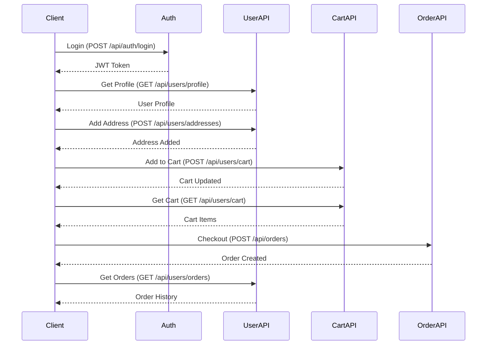

# User Routes - Complete API Documentation

## User Routes (`/api/users`)

All routes in this section require authentication with a valid JWT token.

---

## 1. Get User Profile

**GET** `/api/users/profile`

Get the current authenticated user's complete profile information.

### Headers
```
Authorization: Bearer <jwt_token>
```

### Response (200 OK)
```json
{
  "success": true,
  "data": {
    "id": "665f1a2b3c4d5e6f7g8h9i0j",
    "name": "Farhana Rahman",
    "email": "farhana@example.com",
    "phone": "+8801712345678",
    "role": "user",
    "isVerified": true,
    "isBlocked": false,
    "location": {
      "type": "Point",
      "coordinates": [90.4125, 23.8103]
    },
    "addresses": [
      {
        "id": "addr_001",
        "label": "Home",
        "line1": "House 12, Road 5, Dhanmondi",
        "city": "Dhaka",
        "pincode": "1205",
        "coordinates": [90.4125, 23.8103],
        "isDefault": true
      }
    ],
    "wishlist": [
      {
        "id": "prod_001",
        "name": "Wireless Earbuds",
        "price": 1499,
        "images": ["https://res.cloudinary.com/.../earbuds.jpg"],
        "rating": { "average": 4.3, "count": 27 }
      }
    ],
    "createdAt": "2026-08-10T10:30:00.000Z",
    "updatedAt": "2026-08-11T15:20:00.000Z"
  }
}
```

### Response (401 Unauthorized)
```json
{
  "success": false,
  "message": "Authentication required"
}
```

---

## 2. Update User Profile

**PUT** `/api/users/profile`

Update user profile information.

### Headers
```
Authorization: Bearer <jwt_token>
```

### Request Body
```json
{
  "name": "Farhana Rahman",
  "phone": "+8801712345679"
}
```

### Response (200 OK)
```json
{
  "success": true,
  "data": {
    "id": "665f1a2b3c4d5e6f7g8h9i0j",
    "name": "Farhana Rahman",
    "email": "farhana@example.com",
    "phone": "+8801712345679",
    "role": "user",
    "isVerified": true,
    "updatedAt": "2026-08-11T15:30:00.000Z"
  },
  "message": "Profile updated successfully"
}
```

### Response (400 Bad Request)
```json
{
  "success": false,
  "message": "Invalid input data"
}
```

---

## 3. Update User Location

**PUT** `/api/users/location`

Update the user's current location (used for product search and delivery).

### Headers
```
Authorization: Bearer <jwt_token>
```

### Request Body
```json
{
  "coordinates": [90.4125, 23.8103],
  "source": "geo"  // or "manual"
}
```

### Response (200 OK)
```json
{
  "success": true,
  "data": {
    "location": {
      "type": "Point",
      "coordinates": [90.4125, 23.8103]
    },
    "source": "geo",
    "updatedAt": "2026-08-11T15:35:00.000Z"
  },
  "message": "Location updated successfully"
}
```

### Response (400 Bad Request)
```json
{
  "success": false,
  "message": "Invalid coordinates. Longitude must be -180 to 180, latitude -90 to 90"
}
```

---

## 4. Add Address

**POST** `/api/users/addresses`

Add a new shipping address to the user's account.

### Headers
```
Authorization: Bearer <jwt_token>
```

### Request Body
```json
{
  "label": "Office",
  "line1": "House 45, Road 7, Gulshan",
  "line2": "3rd Floor",
  "city": "Dhaka",
  "pincode": "1212",
  "coordinates": [90.4184, 23.7955],
  "isDefault": false
}
```

### Response (201 Created)
```json
{
  "success": true,
  "data": {
    "address": {
      "id": "addr_002",
      "label": "Office",
      "line1": "House 45, Road 7, Gulshan",
      "line2": "3rd Floor",
      "city": "Dhaka",
      "pincode": "1212",
      "coordinates": [90.4184, 23.7955],
      "isDefault": false
    },
    "addresses": [ /* all addresses */ ]
  },
  "message": "Address added successfully"
}
```

### Response (400 Bad Request)
```json
{
  "success": false,
  "message": "Maximum 5 addresses allowed"
}
```

---

## 5. Update Address

**PUT** `/api/users/addresses/:addressId`

Update an existing shipping address.

### Headers
```
Authorization: Bearer <jwt_token>
```

### Path Parameters
| Parameter | Type | Description |
|-----------|------|-------------|
| `addressId` | string | Address ID to update |

### Request Body
```json
{
  "label": "Office - Updated",
  "line1": "House 45, Road 7, Gulshan",
  "line2": "4th Floor",
  "city": "Dhaka",
  "pincode": "1213",
  "coordinates": [90.4184, 23.7955],
  "isDefault": true
}
```

### Response (200 OK)
```json
{
  "success": true,
  "data": {
    "address": {
      "id": "addr_002",
      "label": "Office - Updated",
      "line1": "House 45, Road 7, Gulshan",
      "line2": "4th Floor",
      "city": "Dhaka",
      "pincode": "1213",
      "coordinates": [90.4184, 23.7955],
      "isDefault": true
    }
  },
  "message": "Address updated successfully"
}
```

### Response (404 Not Found)
```json
{
  "success": false,
  "message": "Address not found"
}
```

---

## 6. Delete Address

**DELETE** `/api/users/addresses/:addressId`

Delete a shipping address.

### Headers
```
Authorization: Bearer <jwt_token>
```

### Path Parameters
| Parameter | Type | Description |
|-----------|------|-------------|
| `addressId` | string | Address ID to delete |

### Response (200 OK)
```json
{
  "success": true,
  "data": {
    "addresses": [ /* remaining addresses */ ]
  },
  "message": "Address deleted successfully"
}
```

### Response (400 Bad Request)
```json
{
  "success": false,
  "message": "Cannot delete default address. Set another address as default first"
}
```

### Response (404 Not Found)
```json
{
  "success": false,
  "message": "Address not found"
}
```

---

## 7. Get User Orders

**GET** `/api/users/orders`

Get the current user's order history with pagination.

### Headers
```
Authorization: Bearer <jwt_token>
```

### Query Parameters
| Parameter | Type | Default | Description |
|-----------|------|---------|-------------|
| `page` | number | 1 | Page number |
| `limit` | number | 10 | Items per page (max 50) |
| `status` | string | - | Filter by order status: `Pending`, `Processing`, `Shipped`, `Delivered`, `Cancelled`, `Refunded` |
| `sort` | string | `-createdAt` | Sort field: `createdAt`, `totalAmount`, `status` (prefix `-` for descending) |

### Response (200 OK)
```json
{
  "success": true,
  "data": {
    "orders": [
      {
        "id": "ord_001",
        "orderId": "ORD-2026-001",
        "sellerId": "sel_001",
        "shopName": "TechHub Dhanmondi",
        "items": [
          {
            "productId": "prod_001",
            "name": "Wireless Earbuds",
            "price": 1499,
            "quantity": 2,
            "productSnapshot": {
              "images": ["https://..."],
              "description": "Premium wireless earbuds..."
            }
          }
        ],
        "totalAmount": 2998,
        "subtotal": 2998,
        "shippingCharge": 50,
        "tax": 0,
        "discount": 0,
        "status": "Delivered",
        "paymentMethod": "stripe",
        "paymentStatus": "paid",
        "shippingAddress": {
          "label": "Home",
          "line1": "House 12, Road 5, Dhanmondi",
          "city": "Dhaka",
          "pincode": "1205"
        },
        "trackingNumber": "TRK-2026-001",
        "estimatedDeliveryDate": "2026-08-15T00:00:00.000Z",
        "deliveryDate": "2026-08-14T14:30:00.000Z",
        "isReviewed": false,
        "createdAt": "2026-08-10T10:30:00.000Z"
      }
    ]
  },
  "pagination": {
    "page": 1,
    "limit": 10,
    "totalPages": 5,
    "totalCount": 45,
    "hasNext": true,
    "hasPrev": false
  }
}
```

### Response (401 Unauthorized)
```json
{
  "success": false,
  "message": "Authentication required"
}
```

---

## 8. Get Order Details

**GET** `/api/users/orders/:orderId`

Get detailed information about a specific order.

### Headers
```
Authorization: Bearer <jwt_token>
```

### Path Parameters
| Parameter | Type | Description |
|-----------|------|-------------|
| `orderId` | string | Order ID |

### Response (200 OK)
```json
{
  "success": true,
  "data": {
    "id": "ord_001",
    "orderId": "ORD-2026-001",
    "sellerId": "sel_001",
    "seller": {
      "id": "sel_001",
      "shopName": "TechHub Dhanmondi",
      "shopAddress": {
        "line1": "Shop 12, Dhanmondi 5",
        "city": "Dhaka",
        "pincode": "1205"
      },
      "isVerified": true
    },
    "items": [
      {
        "productId": "prod_001",
        "name": "Wireless Earbuds",
        "price": 1499,
        "quantity": 2,
        "productSnapshot": {
          "images": ["https://..."],
          "description": "Premium wireless earbuds with noise cancellation",
          "category": "Electronics"
        }
      }
    ],
    "totalAmount": 2998,
    "subtotal": 2998,
    "shippingCharge": 50,
    "tax": 0,
    "discount": 0,
    "couponCode": null,
    "status": "Delivered",
    "statusHistory": [
      {
        "status": "Pending",
        "timestamp": "2026-08-10T10:30:00.000Z"
      },
      {
        "status": "Processing",
        "timestamp": "2026-08-10T12:00:00.000Z"
      },
      {
        "status": "Shipped",
        "timestamp": "2026-08-11T09:00:00.000Z"
      },
      {
        "status": "Delivered",
        "timestamp": "2026-08-14T14:30:00.000Z"
      }
    ],
    "paymentMethod": "stripe",
    "paymentStatus": "paid",
    "paymentReference": "pi_3PqXyZ...",
    "shippingAddress": {
      "label": "Home",
      "line1": "House 12, Road 5, Dhanmondi",
      "line2": null,
      "city": "Dhaka",
      "state": "Dhaka",
      "pincode": "1205",
      "phone": "+8801712345678"
    },
    "trackingNumber": "TRK-2026-001",
    "estimatedDeliveryDate": "2026-08-15T00:00:00.000Z",
    "deliveryDate": "2026-08-14T14:30:00.000Z",
    "isReviewed": false,
    "notes": "Leave at the reception",
    "createdAt": "2026-08-10T10:30:00.000Z",
    "updatedAt": "2026-08-14T14:30:00.000Z"
  }
}
```

### Response (403 Forbidden)
```json
{
  "success": false,
  "message": "You do not have permission to view this order"
}
```

### Response (404 Not Found)
```json
{
  "success": false,
  "message": "Order not found"
}
```

---

## 9. Cancel Order

**PUT** `/api/users/orders/:orderId/cancel`

Cancel an order before it's shipped.

### Headers
```
Authorization: Bearer <jwt_token>
```

### Path Parameters
| Parameter | Type | Description |
|-----------|------|-------------|
| `orderId` | string | Order ID to cancel |

### Request Body
```json
{
  "reason": "Changed my mind"
}
```

### Response (200 OK)
```json
{
  "success": true,
  "data": {
    "orderId": "ord_001",
    "status": "Cancelled",
    "cancellationReason": "Changed my mind",
    "refundAmount": 2998,
    "refundStatus": "pending"
  },
  "message": "Order cancelled successfully"
}
```

### Response (400 Bad Request)
```json
{
  "success": false,
  "message": "Order cannot be cancelled. Current status: Shipped"
}
```

### Response (404 Not Found)
```json
{
  "success": false,
  "message": "Order not found"
}
```

---

## 10. Add to Wishlist

**POST** `/api/users/wishlist/:productId`

Add a product to the user's wishlist.

### Headers
```
Authorization: Bearer <jwt_token>
```

### Path Parameters
| Parameter | Type | Description |
|-----------|------|-------------|
| `productId` | string | Product ID to add to wishlist |

### Response (201 Created)
```json
{
  "success": true,
  "data": {
    "productId": "prod_001",
    "name": "Wireless Earbuds",
    "price": 1499,
    "images": ["https://..."],
    "rating": { "average": 4.3, "count": 27 },
    "addedAt": "2026-08-11T15:40:00.000Z"
  },
  "message": "Product added to wishlist"
}
```

### Response (400 Bad Request)
```json
{
  "success": false,
  "message": "Product already in wishlist"
}
```

### Response (404 Not Found)
```json
{
  "success": false,
  "message": "Product not found"
}
```

---

## 11. Remove from Wishlist

**DELETE** `/api/users/wishlist/:productId`

Remove a product from the user's wishlist.

### Headers
```
Authorization: Bearer <jwt_token>
```

### Path Parameters
| Parameter | Type | Description |
|-----------|------|-------------|
| `productId` | string | Product ID to remove from wishlist |

### Response (200 OK)
```json
{
  "success": true,
  "data": {
    "productId": "prod_001",
    "removedAt": "2026-08-11T15:45:00.000Z"
  },
  "message": "Product removed from wishlist"
}
```

### Response (404 Not Found)
```json
{
  "success": false,
  "message": "Product not in wishlist"
}
```

---

## 12. Get Wishlist

**GET** `/api/users/wishlist`

Get all products in the user's wishlist with pagination.

### Headers
```
Authorization: Bearer <jwt_token>
```

### Query Parameters
| Parameter | Type | Default | Description |
|-----------|------|---------|-------------|
| `page` | number | 1 | Page number |
| `limit` | number | 20 | Items per page (max 50) |

### Response (200 OK)
```json
{
  "success": true,
  "data": {
    "wishlist": [
      {
        "id": "prod_001",
        "name": "Wireless Earbuds",
        "slug": "wireless-earbuds",
        "price": 1499,
        "comparePrice": 1999,
        "discountPercentage": 25,
        "images": ["https://..."],
        "primaryImage": "https://...",
        "rating": { "average": 4.3, "count": 27 },
        "stock": 15,
        "isInStock": true,
        "sellerId": "sel_001",
        "shopName": "TechHub Dhanmondi",
        "addedAt": "2026-08-11T15:40:00.000Z"
      }
    ],
    "totalCount": 1
  },
  "pagination": {
    "page": 1,
    "limit": 20,
    "totalPages": 1,
    "totalCount": 1
  }
}
```

---

## 13. Get Cart

**GET** `/api/users/cart`

Get the current user's cart with all items grouped by seller.

### Headers
```
Authorization: Bearer <jwt_token>
```

### Response (200 OK)
```json
{
  "success": true,
  "data": {
    "cart": {
      "items": [
        {
          "productId": "prod_001",
          "quantity": 2,
          "price": 1499,
          "sellerId": "sel_001"
        }
      ],
      "total": 2998,
      "groups": [
        {
          "sellerId": "sel_001",
          "shopName": "TechHub Dhanmondi",
          "items": [
            {
              "productId": "prod_001",
              "name": "Wireless Earbuds",
              "images": ["https://..."],
              "price": 1499,
              "quantity": 2,
              "stock": 15,
              "isInStock": true,
              "subtotal": 2998
            }
          ],
          "subtotal": 2998
        }
      ]
    }
  }
}
```

### Response (200 OK - Empty Cart)
```json
{
  "success": true,
  "data": {
    "cart": {
      "items": [],
      "total": 0,
      "groups": []
    }
  }
}
```

---

## 14. Add to Cart

**POST** `/api/users/cart`

Add an item to the user's cart.

### Headers
```
Authorization: Bearer <jwt_token>
```

### Request Body
```json
{
  "productId": "prod_001",
  "quantity": 2
}
```

### Response (200 OK)
```json
{
  "success": true,
  "data": {
    "cart": {
      "items": [
        {
          "productId": "prod_001",
          "quantity": 2,
          "price": 1499,
          "sellerId": "sel_001"
        }
      ],
      "total": 2998
    },
    "added": {
      "productId": "prod_001",
      "name": "Wireless Earbuds",
      "quantity": 2,
      "price": 1499
    }
  },
  "message": "Item added to cart"
}
```

### Response (400 Bad Request)
```json
{
  "success": false,
  "message": "Insufficient stock. Available: 5, Requested: 10"
}
```

### Response (404 Not Found)
```json
{
  "success": false,
  "message": "Product not found or unavailable"
}
```

---

## 15. Update Cart Item

**PUT** `/api/users/cart/:productId`

Update the quantity of an item in the cart.

### Headers
```
Authorization: Bearer <jwt_token>
```

### Path Parameters
| Parameter | Type | Description |
|-----------|------|-------------|
| `productId` | string | Product ID to update |

### Request Body
```json
{
  "quantity": 3
}
```

### Response (200 OK)
```json
{
  "success": true,
  "data": {
    "cart": {
      "items": [
        {
          "productId": "prod_001",
          "quantity": 3,
          "price": 1499,
          "sellerId": "sel_001"
        }
      ],
      "total": 4497
    }
  },
  "message": "Cart updated successfully"
}
```

### Response (400 Bad Request)
```json
{
  "success": false,
  "message": "Invalid quantity. Must be at least 1"
}
```

---

## 16. Remove from Cart

**DELETE** `/api/users/cart/:productId`

Remove an item from the cart.

### Headers
```
Authorization: Bearer <jwt_token>
```

### Path Parameters
| Parameter | Type | Description |
|-----------|------|-------------|
| `productId` | string | Product ID to remove |

### Response (200 OK)
```json
{
  "success": true,
  "data": {
    "cart": {
      "items": [],
      "total": 0
    },
    "removed": "prod_001"
  },
  "message": "Item removed from cart"
}
```

### Response (404 Not Found)
```json
{
  "success": false,
  "message": "Item not found in cart"
}
```

---

## 17. Clear Cart

**DELETE** `/api/users/cart`

Clear all items from the user's cart.

### Headers
```
Authorization: Bearer <jwt_token>
```

### Response (200 OK)
```json
{
  "success": true,
  "data": {
    "cart": {
      "items": [],
      "total": 0
    }
  },
  "message": "Cart cleared successfully"
}
```

---

## Error Response Formats

### 400 Bad Request
```json
{
  "success": false,
  "message": "Invalid input. Please check your request data."
}
```

### 401 Unauthorized
```json
{
  "success": false,
  "message": "Authentication required. Please login."
}
```

### 403 Forbidden
```json
{
  "success": false,
  "message": "You do not have permission to perform this action."
}
```

### 404 Not Found
```json
{
  "success": false,
  "message": "Resource not found."
}
```

### 429 Too Many Requests
```json
{
  "success": false,
  "message": "Too many requests. Please try again later."
}
```

### 500 Internal Server Error
```json
{
  "success": false,
  "message": "Internal server error. Please try again later."
}
```

---

## Testing Notes for QA

### Authentication
- All routes require a valid JWT token
- Token expires after 7 days (refresh with `/api/auth/refresh`)
- Test with expired/invalid tokens

### Required Fields
- **Profile Update**: `name` (optional), `phone` (optional)
- **Address**: `label`, `line1`, `city`, `pincode`, `coordinates`
- **Cart**: `productId`, `quantity` (min 1)
- **Order Cancel**: `reason` (optional)

### Test Scenarios

**Positive Tests:**
1. Get profile with valid token
2. Update profile with valid data
3. Add/update/delete addresses
4. Add to wishlist and remove
5. Add to cart, update quantity, remove
6. Get order history with pagination
7. Cancel order before shipping

**Negative Tests:**
1. Access without token (401)
2. Access with invalid token (401)
3. Update address with missing fields (400)
4. Add product to cart with insufficient stock (400)
5. Cancel already shipped order (400)
6. Update non-existent address (404)
7. Add non-existent product to wishlist (404)

**Edge Cases:**
1. Add duplicate product to cart (updates quantity)
2. Add same product to wishlist twice (400)
3. Delete default address without setting new default (400)
4. Cart with items from multiple sellers
5. Order with zero quantity validation
6. Coordinate validation (lng: -180 to 180, lat: -90 to 90)

### Integration Testing Sequence



---

## Version History

| Version | Date | Changes |
|---------|------|---------|
| 1.0 | 2026-08-11 | Initial user routes documentation |